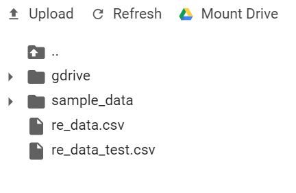

# An Efficient Scientific Submission Recommendation System for Computer Science

Our paper can be found  at 

In this paper, we have researched the Recommendation System that can predict which journals fit with your paper. We use the dataset of authors in this paper 

#  Requirements

This code was tested with python 3.6.8 in https://colab.research.google.com

Packages:  pandas, numpy,  textblob, nltk, re, scikit-learn and pickle 

#  Dataset

This dataset has 9347 documents in the training dataset and 4665 documents in the testing dataset, which are classified into 65 different categories (journals or conferences)

## Data Preprocessing

In this section you can read our paper to know  more
example original data and pre-processed data:
|               |  Original data     | Pre-processed data              |          
| ------------- | ------------- | -------------|
| Title         | " Fighting malicious code: an eternal struggle"  |" fight malici code etern struggl"        |
| Abstract      | "Despite many years of research and significant commercial investment, the malware problem is far from being solved (or even reasonably well contained)..."  | "espit year research signific commerci invest malwar problem far solv reason contain week mainstream press publish articl incid million credit card leak larg .."|
| Keyword       |  "PAC-Bayes bound, support vector machine, generalization capability prediction, classification"|  "pac-bayes bound”, “support vector machine”, “generalization capability prediction”, “classification"            | 

# Run
You should run this code in https://colab.research.google.com

Firstly, pushing 2 data re_data_train and re_data_test as the following:

Secondly,  run step by step according to my instructions in the code 

